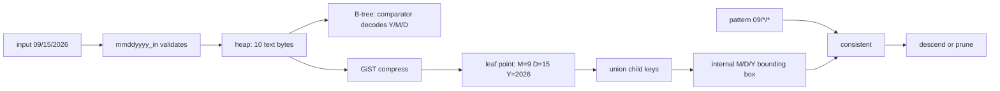

# pg-mm-dd-yyyy: the month-first GiST lab

`mmddyyyy` is an academic PostgreSQL extension for learning how expression
indexes, base types, operators, B-tree operator classes, and GiST operator
classes fit together. The constraint is unusual on purpose: the table must keep
a date literally as fixed-width US-style text, `MM/DD/YYYY`.

The goal is not to promote storing dates as fragmented strings, but to use an
intentionally awkward representation to understand GiST indexes. A B-tree
organizes keys along one global order. For fixed-width text dates, that order
suits a chronological `YYYY-MM-DD` representation. GiST instead lets an
operator class define multidimensional summary keys for internal nodes. Here,
those summaries bound month, day, and year independently, allowing one index to
search efficiently by any combination of components. For seasonal searches,
this model offers a way to reinterpret the month-first `MM/DD/YYYY` format:
month can matter more than year or the exact day.

⚠️ This is not a recommendation to replace PostgreSQL's built-in `date`, which
provides date semantics and validation. When an application treats a date as
more than a point on a timeline and needs attributes such as month, year, day
of the week, or holiday status, a date dimension table may be appropriate.

## 1. The obvious solution: an expression index

Suppose an existing application owns this table and its representation cannot
change:

```sql
CREATE TABLE events_text (
    id bigint GENERATED ALWAYS AS IDENTITY PRIMARY KEY,
    happened_on text NOT NULL
);
```

Define one strict, immutable parser. `make_date` rejects impossible dates such
as `02/30/2026`:

```sql
CREATE FUNCTION us_text_to_date(value text)
RETURNS date
LANGUAGE sql
IMMUTABLE STRICT PARALLEL SAFE
AS $$
    SELECT make_date(
        substring(value FROM 7 FOR 4)::integer,
        substring(value FROM 1 FOR 2)::integer,
        substring(value FROM 4 FOR 2)::integer
    )
$$;

CREATE INDEX events_text_chronology_idx
ON events_text (us_text_to_date(happened_on));
```

Use that expression in queries:

```sql
SELECT *
FROM events_text
WHERE us_text_to_date(happened_on) >= date '2026-09-01'
  AND us_text_to_date(happened_on) <  date '2026-10-01';
```

The heap retains `09/15/2026`; the B-tree stores the derived `date`. This
supports equality, chronological ranges, and chronological sorting without C
code or a custom access method.

Component expression indexes are also enough for month-first lookup:

```sql
CREATE INDEX events_text_month_day_year_idx
ON events_text (
    (substring(happened_on FROM 1 FOR 2)::integer),
    (substring(happened_on FROM 4 FOR 2)::integer),
    (substring(happened_on FROM 7 FOR 4)::integer)
);
```

That B-tree supports month, month plus day, and the complete tuple through its
leftmost prefixes. A day-only query needs another index because day is not the
leading key.

For production, stop here, or better, store `date` and format it for display.
The rest of this project exists to expose PostgreSQL's extensibility.

## 2. Why take `MM/DD/YYYY` seriously?


The usual joke is that the US format is "not ordered on anything." It is not
chronologically ordered: string sorting groups all Januaries, then all
Februaries, while years jump backward and forward. But it *is* ordered on
something: month first, day second, year last.

### When month and day answer the question

Suppose a vineyard records harvest dates for each grape variety across many
vintages. To ask **which varieties tend to be harvested latest in the
season?**, the month and day matter before the year. Ordering by year first
would primarily separate vintages; ordering by month and day first compares
where each harvest falls within the growing season, while the year identifies
the vintage. For this question, the dimension order behind `MM/DD/YYYY` is
meaningful.

Birthdays have the same shape. When looking for two people who share a
birthday, matching the month and day matters; the birth year is secondary and
may be deliberately ignored. Anniversaries, recurring holidays, seasonal
maintenance, and similar events also emphasize a position within the year
rather than one point on a global timeline.

These examples justify treating month, day, and year as independently
searchable dimensions. They do not imply that text order should control every
index: this extension's B-tree remains chronological, while its GiST operator
class exposes the components needed for seasonal and partial-date questions.

`MM/DD/YYYY` is a conventional US numeric format, not the international
standard. The [W3C date-format note](https://www.w3.org/International/questions/qa-date-format.en.html)
describes `MM/DD/YY` as characteristic of the United States and warns that
`03/04/02` is ambiguous across locales. Unicode CLDR documents US-style
patterns such as `M/d/yy`, `MMM d, y`, and `MMMM d, y` in its
[date/time guidance](https://cldr.unicode.org/translation/date-time/date-time-patterns).
The international standard is ISO 8601 `YYYY-MM-DD`; the
[ISO explanation](https://www.iso.org/iso-8601-date-and-time-format.html)
chooses year, month, day to remove ambiguity.

Month-first prose is old. The National Archives transcription of the
[Declaration of Independence](https://www.archives.gov/founding-docs/declaration-transcript)
begins "In Congress, July 4, 1776." It was not the only order in early American
documents: the [Constitution](https://www.archives.gov/founding-docs/constitution-transcript)
closes with "the Seventeenth Day of September in the Year ... one thousand
seven hundred and Eighty seven." The primary evidence shows coexisting English
forms, not one tidy invention story.

MIT's International Students Office presents inheritance from older British
month-first usage as [one hypothesis](https://iso.mit.edu/americanisms/date-format-in-the-united-states/),
not established fact. This project does **not** claim Americans chose the order
for multidimensional search. That is our new interpretation.

Month can genuinely be the most significant component for seasonal demand,
weather, maintenance, birthdays, anniversaries, school terms, or recurring
campaigns. "Some day in September" often conveys more than "the 15th of some
unknown month." The project turns that observation into a search policy:
month, then day, then year.

## 3. What if it were a native type?

The extension adds `mmddyyyy`, whose physical value is exactly the ten displayed
ASCII bytes:

```sql
SELECT '09/15/2026'::mmddyyyy AS value,
       pg_column_size('09/15/2026'::mmddyyyy) AS bytes,
       '09/15/2026'::mmddyyyy::date AS native_date;
```

```text
   value    | bytes | native_date
------------+-------+-------------
 09/15/2026 |    10 | 2026-09-15
```

Input enforces exactly `MM/DD/YYYY`, including leading zeros, Gregorian month
lengths, leap years, and years `0001..9999`. The extension provides casts to
and from `date`, component accessors, comparison operators, and a default
B-tree operator class. The next sections motivate the partial-matching and
similarity operations before introducing their symbols and GiST support.

### Ordinary B-tree syntax, but custom ordering

This is **not** a plain-text B-tree that somehow discovers the year at the end
of the string. A PostgreSQL B-tree does not decide how values compare by itself.
It asks the data type's selected B-tree operator class.

For `text`, the default operator class compares according to the applicable
text collation. With these fixed ASCII strings, that is effectively left to
right, so month comes first:

```sql
SELECT '12/31/2025'::text < '01/01/2026'::text; -- false
```

That result is not chronological. The first character `1` sorts after `0`
before PostgreSQL ever reaches the year.

For `mmddyyyy`, the extension declares `mmddyyyy_btree_ops` as the **default
B-tree operator class**:

```sql
CREATE OPERATOR CLASS mmddyyyy_btree_ops
DEFAULT FOR TYPE mmddyyyy USING btree AS
  OPERATOR 1 <,
  OPERATOR 2 <=,
  OPERATOR 3 =,
  OPERATOR 4 >=,
  OPERATOR 5 >,
  FUNCTION 1 mmddyyyy_cmp(mmddyyyy, mmddyyyy);
```

Support function 1 is the B-tree comparator. `mmddyyyy_cmp` reads the month,
day, and year from each ten-byte value, but compares them in the order year,
month, day:

```c
if (left_year != right_year)
  return left_year < right_year ? -1 : 1;
if (left_month != right_month)
  return left_month < right_month ? -1 : 1;
if (left_day != right_day)
  return left_day < right_day ? -1 : 1;
return 0;
```

Therefore the same visible spellings have different semantics once cast to
`mmddyyyy`:

```sql
SELECT '12/31/2025'::mmddyyyy < '01/01/2026'::mmddyyyy; -- true
```

The index is then created with ordinary SQL syntax:

```sql
CREATE TABLE events (
    id bigint GENERATED ALWAYS AS IDENTITY PRIMARY KEY,
    happened_on mmddyyyy NOT NULL
);

CREATE INDEX events_date_btree ON events (happened_on);

SELECT *
FROM events
WHERE happened_on >= '09/01/2026'
  AND happened_on <  '10/01/2026';
```

Because no operator class is named in `CREATE INDEX`, PostgreSQL selects the
default `mmddyyyy_btree_ops`. During index construction, insertion, lookup, and
range scans, the B-tree calls `mmddyyyy_cmp` to decide which key is smaller and
which branch to follow. The stored datum still begins with the month; its
physical byte layout does not determine its logical sort order.

So "ordinary" referred only to the SQL interface. The ordering is custom. A
clearer description is: **an ordinary PostgreSQL B-tree using the custom
chronological operator class of the native `mmddyyyy` type.**

### From ordering to containment

The B-tree operators compare two complete dates. They answer questions such as
"before September 1" or "between September 1 and October 1." They do not
naturally express the question that motivated this project: **does this date
belong to September, regardless of its day and year?**

For that, the extension introduces a partial calendar pattern and the `<@`
operator:

```sql
SELECT *
FROM events
WHERE happened_on <@ '09/*/*';
```

Read this initially as **"`happened_on` is contained in the set of dates
described by `09/*/*`."** The left operand is one `mmddyyyy`; the right operand
is an `mmddyyyy_pattern` describing many possible dates. The next section defines
that pattern language and the containment rule precisely.

## 4. What exactly does `<@` mean?

`mmddyyyy_pattern` is a second type used for questions. It has the same three
positions, but `*` means "this component is unconstrained":

| Pattern | Set of dates described |
| --- | --- |
| `09/*/*` | Every valid September date in every year |
| `*/15/*` | The 15th day of every month and year |
| `09/15/*` | Every September 15 |
| `09/*/2026` | Every day in September 2026 |
| `*/*/2026` | Every date in 2026 |
| `09/15/2026` | Exactly one date |
| `*/*/*` | Every represented date |

The symbol follows PostgreSQL's usual containment direction. Read
`date <@ pattern` as **"the date is contained by the set described by the
pattern."**

```sql
SELECT '09/15/2026'::mmddyyyy <@ '09/*/*'::mmddyyyy_pattern; -- true
SELECT '09/15/2026'::mmddyyyy <@ '*/15/*'::mmddyyyy_pattern; -- true
SELECT '09/15/2026'::mmddyyyy <@ '10/*/*'::mmddyyyy_pattern; -- false
```

This is component equality with omitted constraints. It is not `LIKE`, a text
prefix, a chronological range, or "earlier than." The `*` is parsed into a
mask inside `mmddyyyy_pattern`; it is not a SQL wildcard.

One GiST index supports every component combination:

```sql
CREATE INDEX events_date_gist ON events USING gist (happened_on);

SELECT * FROM events WHERE happened_on <@ '09/*/*';
SELECT * FROM events WHERE happened_on <@ '*/15/*';
SELECT * FROM events WHERE happened_on <@ '09/*/2026';
```

Unlike the three-component B-tree, the same GiST can prune month-only,
day-only, year-only, and mixed searches. `<@` is GiST strategy 1. At a leaf it
tests one date exactly. At an internal node it asks whether any descendant
*could* match.

Suppose an internal key summarizes descendants as:

```text
month [8,10], day [1,31], year [1980,2030]
```

`09/*/*` may match, so GiST descends. `02/*/*` cannot match, so the entire
subtree is skipped. At a leaf all three ranges collapse to one point, making
the test exact with no heap recheck.

The important word is **three**: these are independent ranges. The key promises
all of the following at once for every descendant:

```text
8 <= month <= 10
1 <= day   <= 31
1980 <= year <= 2030
```

Consequently, any specified dimension can reject this child. `09/*/*` passes
the month test. `*/15/2026` passes the day and year tests. `*/15/2050` fails
the year test, even though month is unconstrained. As the scan descends, child
boxes are usually narrower, so more branches become impossible and are pruned.

A compound B-tree on `(month, day, year)` also stores three columns, but it does
**not** store three independent ranges. It turns each tuple into one position
on one lexicographically ordered line:

```text
(01,01,0001), (01,01,0002), ...,
(01,02,0001), ...,
(02,01,0001), ...,
(12,31,9999)
```

An internal B-tree downlink is bounded by separator keys and therefore covers
one interval on that line. Imagine the interval:

```text
(08,01,1980) <= (month,day,year) < (10,31,2030)
```

Those endpoints are compared as complete tuples, not coordinate by coordinate.
The interval includes `(09,30,9999)`: month 9 lies between months 8 and 10, so
the comparison is decided before the year is examined. The ending year 2030 is
therefore not an independent upper bound on every descendant.

That is what "a B-tree has only one range" means here. It has one range in the
total order defined by `(month, day, year)`. `month = 9` maps to one contiguous
slice and works beautifully. `day = 15` maps to a separate slice within each
month range. `day = 15 AND year = 2026` is still disconnected along that ordered
line. In PostgreSQL 17, our one B-tree scans broadly for those predicates. A
GiST box can test day and year directly at every level because they remain
separate dimensions.

This is not an unqualified advantage. A B-tree has non-overlapping ordered
ranges and usually follows one narrow path for an exact key with all components
constrained. GiST boxes can overlap, so GiST may need to follow several paths.
The benefit is that one index supports many forms of multidimensional query.

## 5. Why introduce `<->`? From matching to ranking

`<@` gives a yes-or-no answer: a date either belongs to the pattern's set or it
does not. It cannot answer the next natural question: **which dates outside the
set are most similar?** For example, for a query of `09/15/2026`, should an
older September date rank before August 15, 2026? The answer depends on the
policy we choose.

The extension makes that policy explicit with a second operator, `<->`, using
PostgreSQL's familiar spelling for distance:

```text
mmddyyyy <-> mmddyyyy_pattern -> double precision
```

Smaller values mean more similar. Zero means the date agrees with every
component constrained by the pattern. Unlike `<@`, distance gives all rows an
ordering rather than dividing them by whether they match.

This enables **k-nearest-neighbor (KNN) search**, which returns the `k` rows
with the smallest distance from a query value. SQL expresses `k` with `LIMIT`:

```sql
SELECT happened_on,
       happened_on <-> '09/15/2026' AS distance
FROM events
ORDER BY happened_on <-> '09/15/2026'
LIMIT 10;
```

Here `k = 10`. Without a suitable index, PostgreSQL must calculate the distance
for every row and sort the results. The GiST operator class registers `<->` as
an ordering operator and supplies a lower-bound `distance` method. PostgreSQL
can then perform a KNN GiST scan and stop after finding ten guaranteed nearest
rows without sorting the whole table. The later implementation section shows
how that ordered scan works.

### Designing "useful information first" distance

For a date and a fully specified pattern, the distance is:

$$
D = 32\delta_m + \lvert d_1-d_2 \rvert
    + \frac{\lvert y_1-y_2 \rvert}{\lvert y_1-y_2 \rvert+1}
$$

where month distance wraps around the end of the year:

$$
\delta_m = \min(\lvert m_1-m_2 \rvert, 12-\lvert m_1-m_2 \rvert).
$$

The weights create strict significance levels:

- any month difference costs at least `32`;
- every possible day difference plus every possible year difference costs less
  than `32`;
- any day difference costs at least `1`;
- every year difference costs less than `1`.

Month therefore dominates day, and day dominates year. December and January
are adjacent. A date in the same month but a distant year can rank before the
corresponding day in an adjacent month. That is intentional: this is similarity,
not elapsed time. Cast to `date` and subtract for elapsed days.

Wildcards contribute zero. Distance from `09/*/*` asks only how far a value's
month is from September; day and year do not participate.

## 6. How the implementation works

### GiST itself: a programmable search tree

GiST means **Generalized Search Tree**. It is not one fixed index algorithm in
the way that PostgreSQL's B-tree is an implementation of ordered B-trees. GiST
is a balanced, many-way tree framework. PostgreSQL owns the page format, tree
height, locking, concurrent page splits, WAL, crash recovery, and scan
machinery. An operator class supplies the domain logic that answers two central
questions:

1. What summary key represents everything below a child page?
2. Given that summary and a query, can any descendant possibly match?

A GiST index consists of ordinary PostgreSQL index pages, normally 8 KiB each:

- The **root page** is block 0.
- An **internal-page tuple** contains a downlink to one child page plus a
  predicate key summarizing every entry in that child subtree.
- A **leaf-page tuple** contains a stored leaf key plus a heap tuple identifier,
  or TID.
- All leaves stay at the same depth. A root split increases the tree height.

The essential invariant is:

> An internal key must include every value reachable through its downlink.

It may include values that are not present. Such false-positive space costs
extra scanning but does not lose answers. Internal keys from sibling branches
may overlap, so a query can descend through several children.

The operator class defines `union` to create the summary and `consistent` to
decide whether a summary can match. That abstraction can implement R-trees,
full-text signatures, nearest-neighbor indexes, ranges, network containment,
and this calendar experiment.

### Why this is not a B-tree

Both are balanced trees, but their navigation contracts are different:

| Property | Compound B-tree `(month, day, year)` | This GiST |
| --- | --- | --- |
| Organizing rule | One global lexicographic order | Operator-class-defined bounding predicates |
| Internal tuple | Separator key plus child downlink | Covering M/D/Y box plus child downlink |
| Sibling regions | Ordered, effectively disjoint key ranges | May overlap in any dimension |
| Search path | Seek to a contiguous ordered range, then scan | Test every candidate downlink and follow all that remain possible |
| Column significance | Leading columns determine useful start/stop bounds | Every specified pattern component can prune a box |
| Natural output | Key order | No general order |
| Special ordering | Chronological order from the comparator | KNN order from the opclass `distance` method |
| Uniqueness | Supported | Not supplied by this operator class |
| Typical strength | Equality, ordered range, `ORDER BY` | Containment, overlap, multidimensional and nearest-neighbor search |

For a B-tree ordered `(month, day, year)`, `month = 9` identifies one contiguous
part of the tree. `day = 15` without a month does not: matching entries occur
inside each of the twelve month ranges. PostgreSQL can check the later key in
the index, but on PostgreSQL 17 it cannot turn that predicate into one narrow
start/stop interval. GiST has no leftmost-prefix rule because every internal box
records independent bounds for all three dimensions.

### Mapping `mmddyyyy` onto GiST

The public value and GiST key are deliberately different:



Keeping the table "as text" cannot mean that an index stores no derived data:
every index has its own keys. The heap value remains the ten text bytes. GiST
stores an eight-byte numeric summary because subtree pruning needs one.

On a leaf page, `compress` turns `09/15/2026` into the degenerate box:

```text
month [9,9], day [15,15], year [2026,2026] -> heap TID
```

On an internal page, one tuple might look like:

```text
month [6,7], day [1,31], year [1,748] -> child block 1404
```

That does **not** say every combination in the box exists. It says every leaf
below child 1404 is guaranteed to have month 6 or 7, day between 1 and 31, and
year between 1 and 748. The parent may safely prune that child for year 2026.

The benchmark uses `pageinspect` to read block 0 directly. A real run displayed
this tuple as:

```text
child_page  (1404,65535)
key         (happened_on)=("([6,7],[1,31],[1,748])")
```

The block number in `ctid` is the GiST downlink; offset `65535` marks an
internal downlink rather than a heap row (`65535` is `0xFFFF`). An empty root
`flags` array means the root is internal. A leaf page reports `{leaf}`, and its
TIDs point to table tuples.

### Fixed-size structures

The C implementation in [src/mmddyyyy.c](src/mmddyyyy.c) uses:

| Structure | Size | Contents |
| --- | ---: | --- |
| `MmDdYyyy` | 10 bytes | The characters `MM/DD/YYYY`, without a trailing NUL |
| `MmDdYyyyPattern` | 6 bytes | `int16` year, byte month/day, and a present-field mask |
| `MmDdYyyyGistKey` | 8 bytes | Lower and upper bounds for month, day, and year |

Compile-time assertions synchronize those layouts with the SQL
`INTERNALLENGTH` declarations in
[sql/mmddyyyy--0.1.0.sql](sql/mmddyyyy--0.1.0.sql).

`mmddyyyy_in` checks the separators and digits, validates Gregorian rules, then
copies the ten original bytes. `mmddyyyy_out` adds a temporary NUL only for the
text protocol. Casts use PostgreSQL's `date2j` and `j2date` routines; converting
from `date` reconstructs canonical zero-padded text.

`mmddyyyy_cmp` decodes both values and compares year, month, day. The SQL script
registers its six operators as a complete B-tree family, so PostgreSQL supplies
normal equality, range, merge, and ordered scans.

`mmddyyyy_pattern_in` parses each number or `*`; its mask distinguishes an absent
component from numeric zero. Patterns are validated as sets: `02/29/*` is
nonempty, but `02/30/*` is impossible and rejected. `mmddyyyy_matches`, exposed
as `<@`, checks only components selected by that mask.

### GiST callbacks

The operator class is a compact R-tree over `(month, day, year)`:

| Callback | What it does here |
| --- | --- |
| `compress` | Converts a 10-byte leaf date into an 8-byte point box |
| `union` | Builds the smallest M/D/Y box containing all child keys |
| `consistent` | Rejects a subtree if a specified pattern value is outside its bounds |
| `penalty` | Scores box growth, weighting month before day before year |
| `picksplit` | Sorts and bisects on the first varying M/D/Y priority dimension |
| `same` | Tests whether two bounding boxes are identical |
| `distance` | Returns exact leaf distance or a lower bound for an internal box |
| `fetch` | Reconstructs exact `MM/DD/YYYY` for index-only scans |

`union`, `consistent`, and `same` establish correctness. `penalty` chooses a
branch for insertion; `picksplit` controls page organization and efficiency.
PostgreSQL supplies page management, concurrency, WAL, recovery, and scans.

### How the tree is built

For each inserted date:

1. `compress` converts the 10-byte text into an 8-byte point box.
2. Starting at the root, PostgreSQL asks `penalty` how much each candidate
  child box would have to expand to include that point.
3. The insertion follows the child with the smallest penalty.
4. `union` expands ancestor boxes where necessary.
5. If a page is full, `picksplit` divides its tuples between two pages and
  returns one bounding box for each new group.
6. PostgreSQL installs or updates the parent downlinks. If the root splits, it
  creates a new tree level.

This extension defines box span as month width weighted by 32, plus day width,
plus a year width that remains below 1. Thus `penalty` strongly prefers keeping
months together. `picksplit` chooses the first varying dimension in the priority
order: month, day, then year. It sorts entries by that dimension's center and
splits at the median. That policy is simple enough to teach, but it can produce
overlapping boxes and is not claimed to be an optimal R-tree split.

The opclass does not implement GiST `sortsupport`. PostgreSQL therefore builds
it through insertion and may use buffered build machinery. In the measured lab,
the compound B-tree built in roughly 3 seconds while GiST took roughly 26
seconds. Build cost is one of the tradeoffs, not an incidental detail.

### How `<@` is scanned

For `happened_on <@ '*/15/2026'`, PostgreSQL performs this tree walk:

1. `mmddyyyy_pattern_in` produces `month = unconstrained`, `day = 15`,
  `year = 2026`.
2. The scan reads root block 0 and calls `consistent` for every root tuple.
3. Month bounds are ignored because month is a wildcard.
4. If 15 is outside a tuple's day interval, or 2026 is outside its year
  interval, `consistent` returns false and that downlink is pruned.
5. Every true result leads to a child page. The process repeats because sibling
  boxes can overlap.
6. On a leaf, all intervals describe one date. The same checks are exact, so a
  matching leaf is returned with `recheck = false`.

In pseudocode:

```text
search(page, pattern):
   for each tuple in page:
      if consistent(tuple.key, pattern):
        if page is a leaf:
           emit tuple
        else:
           search(tuple.child_page, pattern)
```

This recursive description is conceptual. PostgreSQL's executor performs an
iterative, buffered index scan and integrates MVCC visibility through heap
fetches or the visibility map for index-only scans.

`consistent = true` on an internal box means only "worth visiting." On a lossy
GiST, a leaf match may be only a candidate, and PostgreSQL rechecks the operator
against the heap tuple. This extension stores exact point leaves, so its leaf
result is definitive.

### How KNN `<->` is scanned

A KNN GiST scan is not a depth-first walk followed by a sort. PostgreSQL keeps
a priority queue ordered by lower-bound distance:

1. Evaluate `distance` for root entries and queue them.
2. Remove the entry with the smallest lower bound.
3. If it is internal, read that child and queue its entries with their lower
  bounds.
4. If it is a leaf, its point distance is exact and it becomes an output
  candidate.
5. Emit candidates in guaranteed distance order. With `LIMIT`, stop without
  exploring branches whose lower bounds cannot improve the result.

For KNN correctness, an internal distance must never exceed any descendant's
distance. `linear_gap` finds the minimum day or year gap from the query to a
box; `month_gap` finds the minimum circular month gap. The bounded year
transform is monotonic, preserving that lower bound. Leaf boxes are points, so
their distance is exact.

Compression is lossless at leaves: the point box
`([9,9],[15,15],[2026,2026])` uniquely reconstructs `09/15/2026`. Internal
range boxes are summaries and cannot reconstruct one date. GiST calls `fetch`
for leaf tuples, so the callback can still support index-only scans.

Month boxes are linear from 1 through 12 even though distance is circular. This
is correct, but boxes around the December/January boundary may be broad and
cause extra traversal. Wrapped intervals are a worthwhile advanced exercise.

## 7. Full-domain B-tree versus GiST experiment

The heavyweight lab in
[lab/compare-indexes.sql](lab/compare-indexes.sql) generates every representable
day from `01/01/0001` through `12/31/9999`: **3,652,059 rows**. It creates one
compound B-tree and one GiST:

```sql
CREATE INDEX calendar_days_mmddyyyy_btree
ON calendar_days (
    mmddyyyy_month(happened_on),
    mmddyyyy_day(happened_on),
    mmddyyyy_year(happened_on)
)
INCLUDE (happened_on);

CREATE INDEX calendar_days_mmddyyyy_gist
ON calendar_days USING gist (happened_on);
```

`INCLUDE` does not alter the B-tree search order. It carries the original value
so both indexes can perform index-only `count(*)` scans with zero heap fetches.
The lab disables sequential and bitmap scans and parallel workers to expose
what each single index must visit. This is intentionally a structural
comparison; elapsed times depend on cache state and hardware.

One PostgreSQL 17 ARM64 Docker run produced:

| Predicate | Rows | B-tree buffers | GiST buffers | What it demonstrates |
| --- | ---: | ---: | ---: | --- |
| month = 9 | 299,970 | 1,481 | 1,562 | Leading B-tree equality is excellent; GiST adds no advantage |
| day = 15 | 119,988 | 17,994 | 2,080 | B-tree crosses every month range; GiST prunes by day |
| day = 15, year = 2026 | 12 | 17,994 | 122 | Later B-tree keys cannot narrow the leading search; two GiST dimensions prune together |
| exact 09/15/2026 | 1 | 4 | 10 | Fully constrained B-tree descent is leaner |

"Buffers" is `shared hit + shared read` from `EXPLAIN (ANALYZE, BUFFERS)`.
The exact GiST shape varies with insertion and split history, so reruns need not
match every number. The stable lesson is visible in relation size and access:

- The covering B-tree was 141 MiB and the GiST was 151 MiB.
- The B-tree had 18,082 pages and level 2, meaning root, one internal level,
  then leaves.
- The GiST root had 96 downlinks in that run, each with a real bounding box.
- A leading-month or exact query favors B-tree structure.
- A selective combination that omits month lets GiST avoid most of its index,
  while the one month-leading B-tree visits almost every page.

The B-tree plan can still print a day/year `Index Cond`; that means it evaluates
the condition inside the covering index, not that it found a narrow contiguous
range. The near-full 17,994-page visit reveals the difference.

This is the GiST advantage: one index supports many shapes of domain predicate.
It is not a universal speed advantage. Extra storage, overlapping summaries,
slower construction, and less efficient exact lookup are real costs.

## 8. Why not a three-dimensional vector index?

A raw vector `(month, day, year)` plus Euclidean distance does not express this
policy:

- numerical year differences dominate unless dimensions are normalized;
- December and January appear far apart;
- ordinary weights create tradeoffs, not strict significance levels;
- valid dates occupy an irregular subset because month lengths differ.

An expression GiST index using PostgreSQL's `cube` extension is an excellent
comparison experiment. A seasonal embedding could use `(cos(theta),
sin(theta), scaled_year)`. This project implements the operator class directly
so every GiST decision remains visible.

## 9. Run the labs

Docker is the only prerequisite. On Windows:

```powershell
powershell.exe -NoProfile -ExecutionPolicy Bypass -File .\test.ps1
```

Or with Bash:

```bash
bash ./test.sh
```

The suite builds PostgreSQL 17, generates all 73,049 dates from 1900 through
2099, and forces real page splits. It verifies 10-byte values, casts, B-tree
plans, `<@` counts, multi-page GiST scans, index-only KNN, and KNN results
against forced sequential calculations.

Run the shorter narrated comparison in [lab/demo.sql](lab/demo.sql):

```bash
docker compose build
docker compose up -d --wait
MSYS_NO_PATHCONV=1 docker compose exec -T postgres \
  psql -X -U postgres -d mmddyyyy_lab -f /project/lab/demo.sql
docker compose down -v
```

The demo starts with an expression index, then builds the native B-tree and
GiST indexes and displays their query plans.

Run the 3,652,059-row physical and scan comparison on Windows:

```powershell
powershell.exe -NoProfile -ExecutionPolicy Bypass -File .\benchmark.ps1
```

Or with Bash:

```bash
bash ./benchmark.sh
```

The benchmark is deliberately separate from the fast correctness suite. Allow
about 1 GiB of Docker disk headroom. The supplied runners always remove the
database and container when the script finishes.

## Deliberate limits

- Input is canonical `MM/DD/YYYY`; one-digit fields are rejected.
- BC and infinite dates, time zones, and years outside `0001..9999` are absent.
- `<@` uses generic selectivity estimates.
- Binary send/receive and extension upgrade scripts are omitted.
- The split heuristic favors clarity over benchmark-tuned packing.
- The supplied container builds PostgreSQL 17 only.

These limits keep the source inspectable while still exercising a real
multi-page, WAL-logged PostgreSQL GiST index.

## Research sources

- [ISO 8601](https://www.iso.org/iso-8601-date-and-time-format.html): the
  international `YYYY-MM-DD` standard.
- [W3C date formats](https://www.w3.org/International/questions/qa-date-format.en.html):
  locale ambiguity and US `MM/DD/YY`.
- [Unicode CLDR patterns](https://cldr.unicode.org/translation/date-time/date-time-patterns):
  locale-sensitive date patterns.
- [Declaration transcript](https://www.archives.gov/founding-docs/declaration-transcript):
  "July 4, 1776."
- [Constitution transcript](https://www.archives.gov/founding-docs/constitution-transcript):
  "the Seventeenth Day of September ... 1787."
- [MIT on US date format](https://iso.mit.edu/americanisms/date-format-in-the-united-states/):
  present convention and a tentative British-inheritance hypothesis.
- [PostgreSQL 17 GiST documentation](https://www.postgresql.org/docs/17/gist.html):
  access-method and operator-class contracts.
- [PostgreSQL 17 `pageinspect`](https://www.postgresql.org/docs/17/pageinspect.html):
  direct inspection of B-tree and GiST pages.
