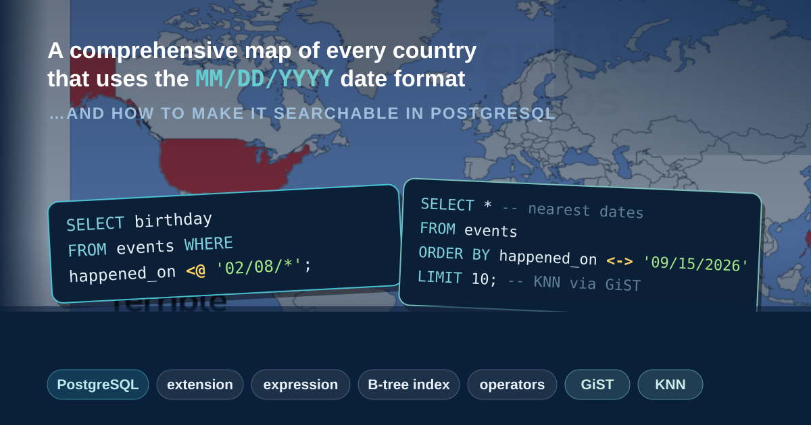
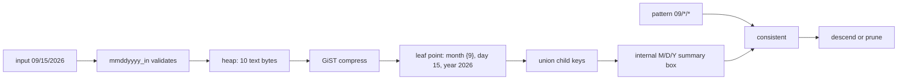

# pg-mm-dd-yyyy: learn PostgreSQL extensions through a gloriously bad idea

This project teaches four of PostgreSQL's most powerful features by building
something no sane person would ship:

- **extensions** — how you add new capabilities to PostgreSQL in C,
- **expression indexes** — how you index a *computed* value, not a stored one,
- **custom operators** — how you teach PostgreSQL new verbs like `<@` and `<->`,
- **specialized indexed types** — how you invent a data type *and* the index
  that makes it fast.

The bad idea that ties them together: **store every date as the literal ten
characters `MM/DD/YYYY`** and then make that terrible choice searchable.

> ⚠️ Do not do this in production. PostgreSQL already has a perfectly good
> `date` type. We are torturing a string on purpose, because a bad-but-simple
> example is the fastest way to *see* what each PostgreSQL feature is really
> for. Every section below tells you the sensible thing to do first, then keeps
> going for the lesson.



## The story

Imagine you inherit an application from a team that stored all its dates as US
text: `09/15/2026`, `12/31/2025`, and so on. You cannot change the column. The
new feature request is deceptively small:

> "Find me everything that happened in **September**, any year."

That one sentence walks us straight through all four features. By the end you
will have:

1. reached for an **expression index** (the correct, boring first answer),
2. discovered its limits and built a **custom type** with its own operators,
3. taught PostgreSQL a containment operator `<@` for partial dates like
   `09/*/*`,
4. added a similarity operator `<->` and a **GiST index** that answers
   "nearest birthdays" without scanning the whole table.

Why is `MM/DD/YYYY` such a fun villain? Because it is not sorted on anything a
computer likes. Sorting the text groups all the Januaries together, then all
the Februaries, while the years jump around inside each group. It is, famously,
used by almost nobody outside the United States:


But here is the twist that makes it worth studying: it *is* ordered on
something. It is ordered **month first, then day, then year**. And it turns out
that is exactly the order you want for a surprising number of real questions.

## 1. The sensible answer first: an expression index

You do not need any of this project to answer "everything in September." You
need an **expression index**, and it is worth understanding why, because it is
the tool you should actually reach for 95% of the time.

Here is the inherited table you are not allowed to change:

```sql
CREATE TABLE events_text (
    id bigint GENERATED ALWAYS AS IDENTITY PRIMARY KEY,
    happened_on text NOT NULL   -- e.g. '09/15/2026'
);
```

An index normally indexes a **column**. An *expression* index indexes the
**result of a function** applied to each row. So we write one small, strict,
immutable function that turns the text into a real `date`, and index *that*:

```sql
CREATE FUNCTION us_text_to_date(value text)
RETURNS date
LANGUAGE sql
IMMUTABLE STRICT PARALLEL SAFE
AS $$
    SELECT make_date(
        substring(value FROM 7 FOR 4)::integer,  -- YYYY
        substring(value FROM 1 FOR 2)::integer,  -- MM
        substring(value FROM 4 FOR 2)::integer   -- DD
    )
$$;

CREATE INDEX events_text_chronology_idx
ON events_text (us_text_to_date(happened_on));
```

`make_date` even rejects impossible dates like `02/30/2026` for free. Now
queries that use the **same expression** hit the index:

```sql
SELECT *
FROM events_text
WHERE us_text_to_date(happened_on) >= date '2026-09-01'
  AND us_text_to_date(happened_on) <  date '2026-10-01';
```

The row on disk is still the ugly text `09/15/2026`; the B-tree quietly stores
the derived `date`. That is the whole point of an expression index: **you keep
your data as-is and index a better view of it.**

There is one sharp edge: the query has to spell the expression *exactly* the
same way as the index, or PostgreSQL won't use it. A cleaner habit is to give
the derived value a name with a **generated column**, so every query refers to
one plain column instead of repeating the function:

```sql
ALTER TABLE events_text
    ADD COLUMN happened_date date
    GENERATED ALWAYS AS (us_text_to_date(happened_on)) STORED;

CREATE INDEX events_text_chronology_idx
ON events_text (happened_date);

SELECT *
FROM events_text
WHERE happened_date >= date '2026-09-01'
  AND happened_date <  date '2026-10-01';
```

`GENERATED ALWAYS AS ... STORED` computes `happened_date` from `happened_on` on
every insert or update and keeps it in sync automatically — you can't write to
it directly, so it can't drift. Now the column, the index, and every query all
speak the same simple name, and there is no way to accidentally miss the index
by phrasing the expression differently. (The function must be `IMMUTABLE`,
which ours is.) This is still just an expression under the hood; the generated
column only gives it a stable, hard-to-misuse name. Verified on PostgreSQL 18,
the query above plans as an `Index Scan using events_text_chronology_idx` with
an `Index Cond` on `happened_date`.

Why `STORED` and not `VIRTUAL`? PostgreSQL 18 added `VIRTUAL` generated columns
(computed on read, no storage) and made them the default. They sound like the
perfect fit here, but two rules rule them out for this case:

- a `VIRTUAL` column's expression **cannot call a user-defined function**, and
  `us_text_to_date` is exactly that — PostgreSQL 18 rejects it with *"Virtual
  generated columns that make use of user-defined functions are not yet
  supported"*;
- you **cannot build an index directly on a `VIRTUAL` column** at all
  (*"indexes on virtual generated columns are not supported"*).

So `STORED` is the right tool: it pays a little disk to give us a real,
indexable column. If your derived value used only built-in functions, `VIRTUAL`
would be viable — but you would still index the underlying *expression*, not the
virtual column itself.

For the pure "which month" question, you can even index the text directly,
because every value has the same fixed width:

```sql
CREATE INDEX events_text_month_first_idx
ON events_text (happened_on text_pattern_ops);

SELECT * FROM events_text WHERE happened_on LIKE '09/%';
```

**For production, stop here.** Or better, store a real `date` and format it for
display. Everything after this point exists to teach you what PostgreSQL lets
you build when the boring answer is not enough — and to make the tradeoffs
visible.

## 2. Why keep going? Because month-first is a real question shape

The joke is that US dates are "ordered on nothing." The deeper truth is that
they are ordered on **month, then day, then year**, and some questions genuinely
want that order.

- A vineyard asks *which grape varieties get harvested latest in the season?*
  The month and day matter first; the year just names the vintage.
- *Who shares a birthday?* Month and day matter; the birth year is often
  deliberately ignored.
- Anniversaries, holidays, seasonal maintenance — all care about *where in the
  year* something falls, not its position on a global timeline.

But notice the moment you take "where in the year" seriously, plain ordering
stops being enough. Sorting says January comes before February comes before
December, so on that line **December looks as far from January as possible.**
Seasonally that is nonsense: a December holiday and a January one are
practically neighbours. The question is no longer "what comes before what" but
"**how close are these two dates in the year?**" — and closeness wraps around
the calendar.

That is the real lesson hiding inside this silly format: **advanced indexes are
not only about linear sorting; they are also about distance.** A B-tree is a
sorting machine and can only ever put values on one line. To rank dates by
seasonal *nearness* — with December next to January — we need an index that
understands distance, which is exactly what GiST gives us (see §6 and §7). Keep
that circular-month idea in the back of your mind; it is what motivates the KNN
operator later.

So we will take the month-first order seriously and ask: what if `MM/DD/YYYY`
were a **native PostgreSQL type**, with its own operators and its own index?
This is not a claim that Americans invented the format for database search —
the [W3C](https://www.w3.org/International/questions/qa-date-format.en.html)
notes it is a US convention and `03/04/02` is ambiguous across locales, and the
international standard is ISO 8601 `YYYY-MM-DD`. It is our own playful
reinterpretation, turned into a working search policy.

## 3. Feature: a specialized type (a PostgreSQL extension in C)

This is where the **extension** comes in. PostgreSQL was built to be extended:
you can add a brand-new data type, written in C, that stores and indexes itself
natively instead of piggy-backing on `text`.

The extension adds a type called `mmddyyyy` whose physical value is *exactly*
the ten displayed bytes:

```sql
SELECT '09/15/2026'::mmddyyyy AS value,
       pg_column_size('09/15/2026'::mmddyyyy) AS bytes,
       '09/15/2026'::mmddyyyy::date AS native_date;
```

```text
   value    | bytes | native_date
------------+-------+-------------
 09/15/2026 |    10 | 2026-09-15
```

Input is validated strictly: correct separators, leading zeros, real Gregorian
month lengths, leap years, and years `0001..9999`. The extension also gives you
casts to and from `date`, accessors for month/day/year, comparison operators,
and a default B-tree operator class. The pieces of an extension:

- `mmddyyyy.control` and `sql/mmddyyyy--0.1.0.sql` register the type,
  functions, casts, and operators with PostgreSQL.
- `src/mmddyyyy.c` implements the behavior in C.
- The `Makefile` compiles it against the PostgreSQL server headers.

### Feature: custom operators (starting with sort order)

Here is the first genuinely surprising thing. A B-tree does **not** know how to
compare your values by itself. It asks the type's **operator class**. So even
though the bytes start with the month, we can tell the B-tree to sort them
*chronologically*.

Plain text sorts left to right, so it gets this wrong:

```sql
SELECT '12/31/2025'::text < '01/01/2026'::text;  -- false (1 sorts after 0)
```

But `mmddyyyy` ships a comparison function, `mmddyyyy_cmp`, that reads out the
year, month, and day and compares them in **year, month, day** order:

```c
if (left_year  != right_year)  return left_year  < right_year  ? -1 : 1;
if (left_month != right_month) return left_month < right_month ? -1 : 1;
if (left_day   != right_day)   return left_day   < right_day   ? -1 : 1;
return 0;
```

We register it as the type's **default B-tree operator class**, so the same
visible spelling now sorts chronologically:

```sql
SELECT '12/31/2025'::mmddyyyy < '01/01/2026'::mmddyyyy;  -- true
```

Create the index with completely ordinary SQL — PostgreSQL picks the default
operator class automatically:

```sql
CREATE TABLE events (
    id bigint GENERATED ALWAYS AS IDENTITY PRIMARY KEY,
    happened_on mmddyyyy NOT NULL
);

CREATE INDEX events_date_btree ON events (happened_on);

SELECT * FROM events
WHERE happened_on >= '09/01/2026' AND happened_on < '10/01/2026';
```

The lesson: **"ordinary SQL" hides a custom operator.** The syntax is normal;
the ordering is something we defined in C.

## 4. Feature: a custom operator for a new question (`<@`)

The B-tree comparison operators compare two *complete* dates. They are great for
"before September 1" or "between two dates." They cannot express the question we
started with: **does this date belong to September, regardless of day and
year?**

So we invent a second type, `mmddyyyy_pattern`, where any component can be `*`
("I don't care"), and a new operator `<@` that reads as **"the date is contained
in the set the pattern describes."**

| Pattern | Set of dates it describes |
| --- | --- |
| `09/*/*` | Every September date, any day, any year |
| `*/15/*` | The 15th of every month, every year |
| `09/15/*` | Every September 15 |
| `09/*/2026` | Every day in September 2026 |
| `*/*/2026` | Every date in 2026 |
| `09/15/2026` | Exactly one date |

```sql
SELECT '09/15/2026'::mmddyyyy <@ '09/*/*'::mmddyyyy_pattern;  -- true
SELECT '09/15/2026'::mmddyyyy <@ '*/15/*'::mmddyyyy_pattern;  -- true
SELECT '09/15/2026'::mmddyyyy <@ '10/*/*'::mmddyyyy_pattern;  -- false
```

This is *component equality with wildcards*. It is not `LIKE`, not a text
prefix, not a range. The `*` becomes a bitmask inside the pattern, not a SQL
wildcard.

## 5. Feature: a specialized index (GiST) to make `<@` fast

We can now *ask* the question, but answering it quickly is a new problem. A
normal compound B-tree on `(month, day, year)` is fast for `month = 9`
(the leading column) but useless for `day = 15` alone, because matching rows are
scattered across all twelve month ranges.

The reason is fundamental: **a B-tree squeezes three columns onto one ordered
line.**

```text
(01,01,0001), (01,01,0002), ..., (01,02,0001), ..., (12,31,9999)
```

`month = 9` is one contiguous slice of that line. `day = 15` is a little piece
inside *every* month's slice — not contiguous, so the B-tree cannot jump
straight to it.

**GiST** (Generalized Search Tree) is a different kind of index. Instead of one
global order, every internal node stores a **summary box** that bounds its
children in *each dimension independently*:

```text
month {8,9,10}   day [1,31]   year [1980,2030]
```

That box promises: every date below me has a month in {8,9,10}, a day in
[1,31], and a year in [1980,2030] — **all at once, and independently**. So *any*
specified component can rule the whole subtree out:

- `09/*/*` → month 9 is in the set → maybe, descend.
- `02/*/*` → month 2 is not in the set → skip this entire subtree.
- `*/15/2050` → year 2050 is outside [1980,2030] → skip, even though the month
  was a wildcard.

One GiST index handles month-only, day-only, year-only, and any mix:

```sql
CREATE INDEX events_date_gist ON events USING gist (happened_on);

SELECT * FROM events WHERE happened_on <@ '09/*/*';
SELECT * FROM events WHERE happened_on <@ '*/15/*';
SELECT * FROM events WHERE happened_on <@ '09/*/2026';
```

That flexibility is the whole reason GiST exists, and it is why we needed a
custom type: **a specialized index and a specialized type are designed
together.**

## 6. Feature: an ordering operator (`<->`) for "nearest" search

`<@` gives a yes/no answer. The next natural question has no yes/no answer:
**which dates are *most similar* to September 15, 2026?** Should an old
September date rank ahead of August 15 the same year? That is a *policy*, and we
make it explicit with a distance operator `<->`:

```sql
SELECT happened_on, happened_on <-> '09/15/2026' AS distance
FROM events
ORDER BY happened_on <-> '09/15/2026'
LIMIT 10;
```

`ORDER BY distance LIMIT k` is **k-nearest-neighbor (KNN) search**. The
distance we chose makes month dominate day, and day dominate year, with the
month measured *around the calendar circle* so December and January are
neighbours:

$$
D = 32\,\delta_m + \lvert d_1-d_2 \rvert
    + \frac{\lvert y_1-y_2 \rvert}{\lvert y_1-y_2 \rvert+1},
\qquad
\delta_m = \min(\lvert m_1-m_2 \rvert,\ 12-\lvert m_1-m_2 \rvert).
$$

The weights create strict tiers: any month difference costs at least 32; any day
difference at least 1; every possible year difference stays under 1. So this
is *seasonal* similarity, not elapsed time. Wildcards contribute zero — distance
from `09/*/*` only measures how far your month is from September. Our GiST
operator class registers `<->` as an **ordering operator** and supplies a
lower-bound distance for internal boxes, so PostgreSQL can walk the tree in
distance order and stop after `k` rows instead of scoring every row.

## 7. How the GiST index actually works

The public value and the GiST key are deliberately different things:



The heap keeps the ten text bytes. The GiST stores a separate **8-byte summary
key** per entry, because pruning a subtree needs a compact bound. The three
fixed-size C structures are:

| Structure | Size | Contents |
| --- | ---: | --- |
| `MmDdYyyy` | 10 bytes | The characters `MM/DD/YYYY`, no trailing NUL |
| `MmDdYyyyPattern` | 6 bytes | `int16` year, byte month/day, and a present-field mask |
| `MmDdYyyyGistKey` | 8 bytes | Year range, a 12-bit **month bitmap**, and a day range |

Compile-time assertions (`StaticAssertDecl`) keep those layouts locked to the
`INTERNALLENGTH` values declared in
[sql/mmddyyyy--0.1.0.sql](sql/mmddyyyy--0.1.0.sql), so the C and SQL sides can
never drift apart silently.

### Months are a circle, not a line

This is the most interesting design detail, and one worth understanding.

Day and year are ordinary ranges: `[min, max]`. But months wrap around — a
subtree holding only December and January dates is a *tight* seasonal cluster,
yet a naive range would record it as `[1, 12]`, the "any month" box that can
never prune anything.

So the month component of the GiST key is stored as a **12-bit bitmap**
(`month_mask`): bit *m−1* is set when some date below has month *m*. That makes
the box for a December/January cluster print as `{1,12}` — two months — instead
of the useless span `[1,12]`:

```text
({9},[15,15],[2026,2026])     -- a leaf: exactly 09/15/2026
({6,7},[1,31],[1,748])        -- an internal box: June & July, days 1-31, years 1-748
({12,1},[1,31],[2000,2001])   -- a tight winter cluster, NOT "every month"
```

The bitmap also makes two GiST operations clean:

- **union** (combining child boxes) is a bitwise OR — exact and
  order-independent, exactly what GiST wants.
- **distance** looks only at months actually present, and measures each one
  around the circle, so the Dec/Jan box is genuinely *near* January.

On disk the layout stays 8 bytes: two `int16` year bounds, one `uint16` month
bitmap, two `uint8` day bounds.

### The operator-class callbacks

A GiST operator class is a set of C functions PostgreSQL calls at the right
moments. Ours:

| Callback | What it does here |
| --- | --- |
| `compress` | Turns a 10-byte leaf date into an 8-byte summary (one month bit, point day/year) |
| `union` | Combines child summaries: OR the month bitmaps, widen day/year ranges |
| `consistent` | Given a summary and a pattern, decides if any descendant *could* match |
| `penalty` | Scores how much a box must grow to absorb a new entry (month counts most) |
| `picksplit` | Splits a full page into two groups, preferring tight months |
| `same` | Tests whether two summaries are identical |
| `distance` | Exact distance at a leaf; a never-too-large lower bound for a box (for KNN) |
| `fetch` | Rebuilds the exact `MM/DD/YYYY` text for index-only scans |

PostgreSQL owns the hard parts — page layout, tree height, locking, WAL, crash
recovery, concurrent splits, and the scan machinery. The operator class only
supplies the domain logic. That division of labor is what makes GiST reusable
for R-trees, full-text search, ranges, and this calendar experiment alike.

### Reading a real GiST page

The benchmark uses the `pageinspect` extension to read block 0 (the root)
directly, so you can *see* the summary boxes PostgreSQL built:

```text
child_page  (1404,65535)
key         (happened_on)=("({6,7},[1,31],[1,748])")
```

The block number is the downlink to a child page; offset `65535` (`0xFFFF`)
marks it as an internal downlink rather than a heap row. The `key` is that
child's summary box in the `({months},[day_lo,day_hi],[year_lo,year_hi])` form
produced by the type's output function.

## 8. See the difference: B-tree vs GiST on the full calendar

The heavy lab in [lab/compare-indexes.sql](lab/compare-indexes.sql) generates
**every representable day** from `01/01/0001` through `12/31/9999` — 3,652,059
rows — and builds one compound B-tree and one GiST over the same components:

```sql
CREATE INDEX calendar_days_mmddyyyy_btree
ON calendar_days (
    mmddyyyy_month(happened_on),
    mmddyyyy_day(happened_on),
    mmddyyyy_year(happened_on)
)
INCLUDE (happened_on);

CREATE INDEX calendar_days_mmddyyyy_gist
ON calendar_days USING gist (happened_on);
```

With sequential/bitmap scans and parallelism disabled to expose what each index
must visit, one run showed the pattern clearly (exact numbers vary by hardware
and build history — rerun the lab to regenerate them):

| Predicate | Rows | B-tree buffers | GiST buffers | Lesson |
| --- | ---: | ---: | ---: | --- |
| month = 9 | 299,970 | 1,481 | 1,562 | Leading B-tree equality is excellent; GiST ties |
| day = 15 | 119,988 | 17,994 | 2,080 | B-tree crosses every month; GiST prunes by day |
| day = 15, year = 2026 | 12 | 17,994 | 122 | B-tree can't narrow; two GiST dimensions prune together |
| exact 09/15/2026 | 1 | 4 | 10 | Fully constrained B-tree descent is leanest |

The honest summary: **GiST's strength is flexibility, not raw speed.** One GiST
index answers many shapes of question. In exchange you pay with more storage,
overlapping summary boxes, slower builds, and less efficient exact lookups. For
a leading-column or fully-specified query, the B-tree still wins. Choosing the
right index is about matching the tool to the questions you actually ask.

## 9. Run it yourself

Docker is the only prerequisite. Everything builds PostgreSQL 17 with the
extension compiled under `-Wall -Wextra -Werror`, so a build failure is a real
defect.

**Fast correctness suite** (73,049 dates, 1900–2099; verifies types, casts,
B-tree plans, `<@` counts, multi-page GiST, index-only KNN, and KNN vs a forced
sequential scan):

```bash
bash ./test.sh
```

```powershell
powershell.exe -NoProfile -ExecutionPolicy Bypass -File .\test.ps1
```

**Narrated demo** (walks from the expression index up to GiST and KNN plans):

```bash
docker compose build
docker compose up -d --wait
MSYS_NO_PATHCONV=1 docker compose exec -T postgres \
  psql -X -U postgres -d mmddyyyy_lab -f /project/lab/demo.sql
docker compose down -v
```

**Full 3.65M-row comparison** (allow ~1 GiB of Docker disk headroom):

```bash
bash ./benchmark.sh
```

```powershell
powershell.exe -NoProfile -ExecutionPolicy Bypass -File .\benchmark.ps1
```

The same suite runs automatically in CI on every push
([.github/workflows/ci.yml](.github/workflows/ci.yml)).

## What this project deliberately leaves out

To keep the source readable, some real-world concerns are out of scope:

- Input must be canonical `MM/DD/YYYY`; one-digit fields are rejected.
- No BC dates, infinite dates, time zones, or years outside `0001..9999`.
- `<@` uses generic selectivity estimates.
- No binary send/receive functions or extension upgrade scripts.
- The GiST split heuristic favors clarity over benchmark-tuned packing.
- The container builds PostgreSQL 17 only.

None of these change the lessons; they just keep the code small enough to read
in one sitting.

## Where to go next

- **PostgreSQL docs:** [GiST](https://www.postgresql.org/docs/17/gist.html) and
  [`pageinspect`](https://www.postgresql.org/docs/17/pageinspect.html).
- **Try a vector approach:** a `cube`-based GiST index over
  `(cos θ, sin θ, scaled_year)` is a great comparison exercise — see why raw
  Euclidean distance does *not* give the strict month > day > year tiers this
  project enforces.
- **Read the source:** [src/mmddyyyy.c](src/mmddyyyy.c) is heavily commented and
  meant to be read top to bottom.

### Background on the format

- [ISO 8601](https://www.iso.org/iso-8601-date-and-time-format.html): the
  international `YYYY-MM-DD` standard.
- [W3C date formats](https://www.w3.org/International/questions/qa-date-format.en.html):
  locale ambiguity and US `MM/DD/YY`.
- [Unicode CLDR patterns](https://cldr.unicode.org/translation/date-time/date-time-patterns):
  locale-sensitive date patterns.
- [MIT on the US date format](https://iso.mit.edu/americanisms/date-format-in-the-united-states/):
  the tentative British-inheritance hypothesis.

## Final thoughts

Comparing PostgreSQL with other databases while ignoring its extensibility
framework misses what makes it different. PostgreSQL was built as an
object-relational system: you can register a new **base type** with its own
input/output functions, define **operators** backed by C functions, and teach
an existing **access method** how to index that type through an **operator
class** and its **support functions**. That is exactly what this project does —
`mmddyyyy` is a base type, `<@` and `<->` are operators, and `mmddyyyy_gist_ops`
is a GiST operator class. This is far more than a hook for supplying a sort or
comparison callback.

The leverage is in the division of labor. The whole extension is on the order
of a few hundred lines of C, and none of it touches the hard parts of a
database engine. I never wrote a line dealing with MVCC visibility, tuple
locking, buffer management, WAL, or crash recovery. My code is responsible only
for the *domain logic* — how a date is parsed, compared, bounded into a GiST
key, and scored for distance. Everything that makes an index safe and fast under
concurrency and failure — durability, transactional consistency, page-level
locking, and recovery — stays in the PostgreSQL core and the GiST access method.
You extend the semantics; PostgreSQL keeps the guarantees.
